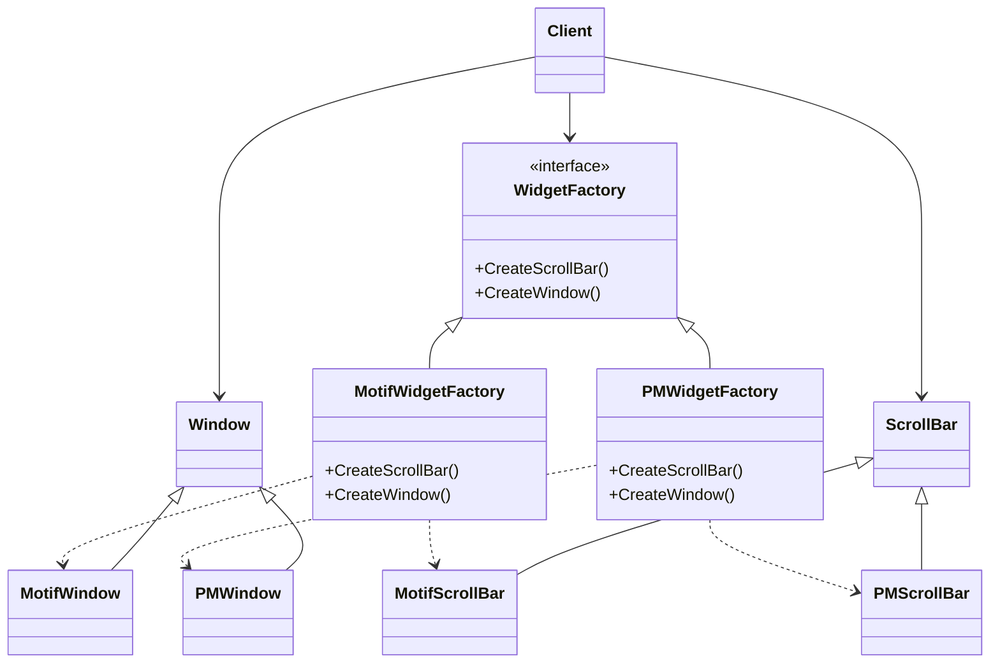

![[Pasted image 20250422000831.png]]
#### Module 
Es el nombre del módulo. Puede ser una cadena de caracteres cualquiera4. Este nombre
se usará en futuras referencias.
#### Exports 
Son las signaturas de las subrutinas de la interfaz del módulo. La signatura de una
subrutina, también llamada prototipo o encabezado, está constituida por el nombre, los
parámetros y los valores de retorno de la misma. Cada subrutina se lista en una línea
separada.
#### Comments 
Texto libre para comentar aspectos del módulo o su interfaz que se consideren complicados.
No abusar de esta cláusula. En la sección 10 veremos los documentos apropiados
para describir otros aspectos de cada módulo. Además tener en cuenta que la caja que
encierra la descripción “formal” de cada módulo permite intercalar todo el texto informal
que se desee entre la descripción de los módulos5; tampoco abusar de esta posibilidad.

En 2MIL la herencia se expresa de la siguiente forma:
![[Pasted image 20250503111751.png]]

Esto quiere decir que hereda todo
![[Pasted image 20250503112245.png]]

![[Pasted image 20250511185607.png]]