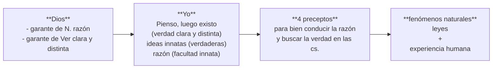

## Parte IV    
Ya empezando a plantear su sistema, Descartes trata de buscar un fundamento metafísico ineludible que sirva como piedra angular de su sistema. Se pregunta ¿cómo encontrar una verdad metafísica sin nada sobre que construirla?     
   
Usando la duda metódica: Un ejercicio mental para distanciarse de sus propias creencias, rechaza como falso todo a lo que se le ocurra la menor duda. Quería ver si encontraba algo que no pudiera rechazar.    
   
Duda del saber sensible (sentidos) y del saber racional ya que puede haber razonamientos equivocados. Así que duda de todo su conocimiento. Pero encuentra que no puede dudar de su duda, y para dudar tiene que existir. Entonces llega a una verdad fundamental, Pienso, luego existo. En otras palabras no se puede dudar de la existencia de uno mismo, ya que con el hecho de dudar ya existis.  
  
**Dualismo cartesiano:** el yo (alma) era una sustancia cuya esencia o forma es el pensar, que no necesita al cuerpo. Dualismo mente-cuerpo

**Criterio de verdad a partir de su principio fundamental:** Luego de hacer un análisis, descartes respalda su primer precepto, donde asume de manera general como verdadero toda aquella evidencia que resulta clara y distinta. Es usar la duda metódica pero sin dudar de si mismo.

 **Demostración de la existencia de Dios:** Era clave para que Descartes confié en su sistema de razon. Básicamente asume nociones, que denomina ideas innatas, como: lo más perfecto no puede provenir de lo menos perfecto o que algo provenga de la nada. Usando estas ideas concluye que existe algo anterior a el y mas perfecto que el. (Es inteligente porque aparentemente no rompe con su ideología que toma a si mismo como verdad principal, ya que partiendo del Yo demuestra dios)

**Discernimiento entre la vigilia y el sueño:** Usando su criterio de verdad para determinar que los sueños no deben hacerlo dudar de sus pensamientos despierto.

**Esquema del sistema cartesiano:**

## Parte V    
**Sus hallazgos científicos:** Descartes quiere usar su método para explicar todo, inclusive su interpretación mecanicista del cuerpo animal y humano.

**Sobre los autómatas y la inmortalidad del alma:** Reflexiona sobre la posibilidad de discernir entre una máquina que tuviese los mismos órganos que un hombre y un hombre mismo, diciendo que un autómata podría imitar a un animal pero fallaría con un humano ya que estarían desprovistos de la razon y del lenguaje.

Luego, basándose en que no hay cosas que veamos que destruyan el alma, la juzga inmortal.

## Parte VI
**Los beneficios de sus investigaciones para el progreso en la tecnología y la salud:** Opina que aplicar sus principios deriva al bienestar humano y el interés general de la sociedad. Evitar usar la filosofía especulativa de la época, podría permitir al hombre hacerse dueño de la naturaleza. Opina que principalmente se exhibiría esto en el campo de la medicina.

**Un gran proyecto de investigación unificado:** Descartes presento su filosofía como un gran proyecto de investigación unificado, que conecta vidas y trabajos atreves del tiempo, con la promesa de rendimientos prácticos en pos del bienestar general. Descartes estaba presagiando la idea que hoy tenemos del conocimiento científico como una construcción colectiva. Este proyecto cartesiano sobre la unidad del saber y la confianza en las ciencias será concretado, cien años más tarde, por Diderot y D’alambert mediante la confección de la Enciclopedia francesa en 1750.

 **La utilización del francés en vez del latín:** finalmente Descartes explica porque escribió su Discurso en francés, y no en latín 
 
"Espero que los que hagan uso de su pura razón natural juzgaran mejor mis opiniones que los que solo creen en los libros antiguos; y en cuanto a los que unen el buen sentido con el estudio, y los cuales deseo que sean mis únicos jueces, no serán seguramente tan parciales en favor del latín, que se rehúsen a oír mis razones, en razón de haberlas explicado en lengua vulgar”